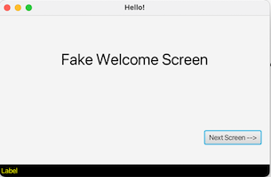
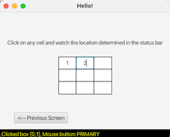

# MultiSceneTest

---
### Author
Prof. Brian R. King  
Bucknell University  
Dept. of Computer Science  
Lewisburg, PA 17837

First commit: 2022-Fall-11  
Version 1.0.01

---
### Description

This project contains some simple code to help students out with understanding how to accomplish a variety of tasks using JavaFX. Most of this was developed to show how to use Gradle to build a standalone, distributable JavaFX application. But, there are some specific features in the code that, over time, I'll keep adding as I get student questions:

1. Demonstrate how to change `Scene` objects on a `Stage`, where the scenes were developed using [SceneBuilder](https://gluonhq.com/products/scene-builder/).
    1. There are two FXML files. Switch between the scenes by click on the button on each scene
2. A couple teams have used `GridPane` to develop some sort of board game like checkers, chess, or a grid-like game such as sudoku. This example demonstrate how to obtain the cell location when the user clicks on an object managed using a `GridPane`

I expect this to continue to be refined and improved over time. It was thrown together rather quickly. 

---
### Development Workflow Features

* Uses Gradle for build management
* Uses JavaFX plugin, which is pretty simple thanks to the [JavaFX Gradle Plugin](https://github.com/openjfx/javafx-gradle-plugin)
* Uses the [**Java Platform Module System**](https://www.oracle.com/corporate/features/understanding-java-9-modules.html). 
> I force every project now to use the module system. TBH, I found it to be quite challenging to adapt my development workflow to start using JPMS. I attribute my frustration due to having been a long-time Java developer going back to Java 4. But, forcing myself to suffer through the learning curve... it's making sense now.*
* JPMS support:
  * The requisite `module-info.java` file is included in the root of the package folder
  * I rely on the [Java Module plugin for Gradle](https://github.com/java9-modularity/gradle-modules-plugin) which made managing modules significantly easier
* Uses the [Badass JLink Plugin](https://badass-jlink-plugin.beryx.org/releases/latest/), which is a must for any team who wants to OS dependent distribution.

---
### Instructions

Of course, when cloning a new repository with Gradle, do not forget to issue the `gradle wrapper` command in your project directory. 

* `./gradlew build` - build the application
*  `./gradlew jlink` - builds a modular runtime image. After you run this, you should have a distributable image in your `./build/image` folder. For this application, you could run `./build/image/bin/multiscenetest`
* `./gradlew jpackage` - builds an operating system dependent executable. For example, running this on MacOS, I now have a `.dmg` file that I could distribute my application. You could also test it out by opening the terminal, changing to `./build/jpackage/` and run your application from there. For example, on MacOS, `./open -a multiscenetest.app`

Hope this helps!  
-BRK