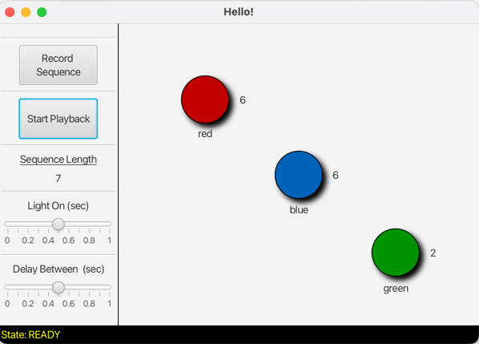

# JavaFX Examples

---
### Author
Prof. Brian R. King  
Bucknell University  
Dept. of Computer Science  
Lewisburg, PA 17837

Version 1.01.02  
Date: 2022-Nov-18

---
### Description

This project contains some simple code to help students understand how to accomplish a variety of tasks using JavaFX, including:

1. How to use Gradle to build a standalone, distributable application fully bundled with requisite JavaFX support libraries.
2. Demonstrate how to change `Scene` objects on a `Stage`, where the scenes were developed using [SceneBuilder](https://gluonhq.com/products/scene-builder/).
    1. There are multiple FXML files. The first scene has a button that will quickly switch to the other scenes.  
2. Using `GridPane` and identifying the cell that was clicked on. (Many teams use a `GridPane` container to develop some sort of board game like checkers, chess, or a grid-like game such as sudoku.) The user clicks on an object managed using a `GridPane`, and the cell will be identified in the status bar.
3. A demonstration of animation with Timeline.
4. A basic illustration of MVC with a model to manage lights and light sequences, a view with FXML, and a separate controller. 
   1. This example shows how to use a `Thread`, and more importantly, how to ensure any code in your thread that triggers an update on your GUI must be placed in your JavaFX Application Thread by using `Platform.runLater()`. NEVER have any code that does a lot of processing running in your main JavaFX thread. It must be run in a separate thread.

I expect this code to continue to be refined and improved over time. It was thrown together rather quickly. 

   
  
  
  
---
### Development Workflow Features

* Uses Gradle for build management
* Uses the [JavaFX Gradle Plugin](https://github.com/openjfx/javafx-gradle-plugin) 
* Uses the [**Java Platform Module System**](https://www.oracle.com/corporate/features/understanding-java-9-modules.html). 
> I force every project now to use the module system. TBH, I found it to be quite challenging to adapt my development workflow to start using JPMS. I attribute my frustration due to having been a long-time Java developer going back to Java 4. But, forcing myself to suffer through the learning curve... it's making sense now.*
* JPMS support:
  * The requisite `module-info.java` file is included in the root of the package folder
  * I rely on the [Java Module plugin for Gradle](https://github.com/java9-modularity/gradle-modules-plugin) which made managing modules significantly easier
* Uses the [Badass JLink Plugin](https://badass-jlink-plugin.beryx.org/releases/latest/), which is a must for any team who wants to generate an OS dependent distributable executable.

---
### Instructions

When cloning a new repository with Gradle, do not forget to issue the `gradle wrapper` command in your project directory.

* `./gradlew build` - build the application
*  `./gradlew jlink` - builds a modular runtime image. After you run this, you should have a distributable `.tar` or `.zip` file you can distribute, though this requires opening up the terminal and running your app from the command line. To test it out, in your `./build/image` folder. For this application, from your project folder, run `./build/image/bin/multiscenetest`
* `./gradlew jpackage` - builds an operating system dependent executable package (with all JavaFX libraries bundled) that you can easily distribute. For example, running this on MacOS produces a `.dmg` file for distribution. You can open this file and drag your application to your `Applications` folder, or test it out by opening the terminal, changing to `./build/jpackage/` folder and run your application from there. For example, on MacOS, `./open -a multiscenetest.app`

Hope this helps!  
-BRK